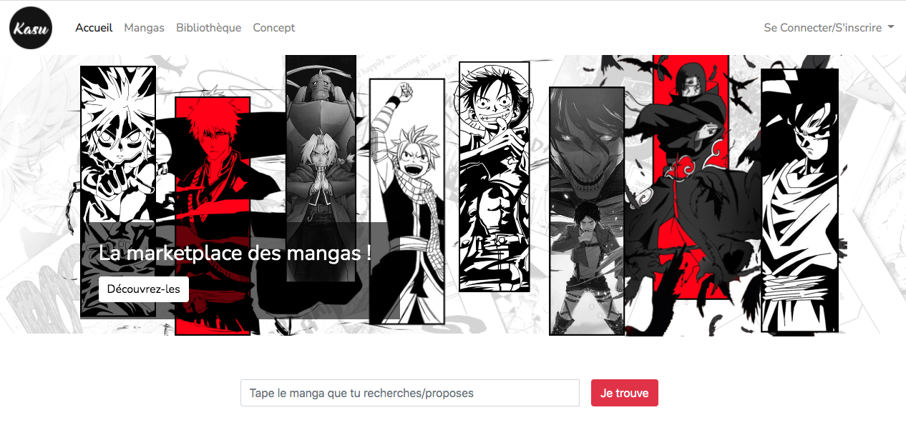

# KASU - Plateforme d'échange de Mangas

Kasu est une plateforme d'échange de Mangas. Grâce à la création de compte, les utilisateurs peuvent construire une Bibliothèque et une Wishlist. 
Ils informent ainsi la communauté des mangas qu'ils souhaitent echanger et ceux qu'ils recherchent.

Avec la mise en place d'une messagerie, chaques utilisateurs peut contacter directement les personnes disposant du manga recherché.
L'échange est possible grâce à la mise en place d'une monnaie virtuelle. 

## Les fonctionnalités :
- Création de compte
- Création de Bibliothèques et Wishlist
- Système de messagarie
- Acceptation ou non de la demande
- Solde de "Kasu Point" automatiquement crédité ou débité

## Visualisation

```
Accédez à notre site sur : https://kasu-project.herokuapp.com/

```
